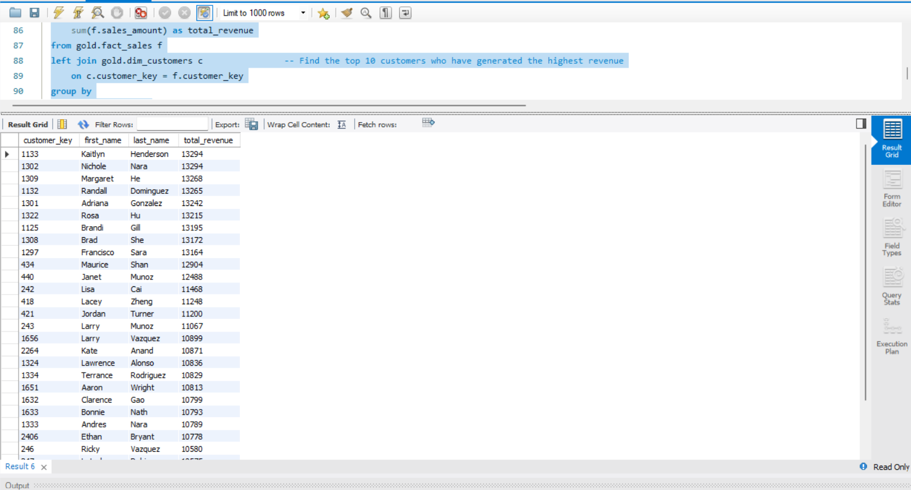

# EDA_project  
```Prerequisite: This project uses the Gold layer created in the Data Warehouse project.```  
  
### 📖 Project Overview:  

This folder contains SQL-based Exploratory Data Analysis (EDA) performed on the Gold Layer of the Data Warehouse project.  

The analysis uses the Fact tables and dimension tables, to generate insights into customers, products, and sales performance. The objective is to help data analysts and BI professionals quickly explore, segment, and analyze data within a relational database. The script focuses on a specific analytical theme and demonstrates best practices for SQL queries.  


## 📝 Exploration Categories  
  
The Exploration.sql file is organized into the following sections.  
1. Database Exploration
2. Dimension Exploration
3. Data Exploration
4. Measure Exploration
5. Magnitude Analysis
6. Ranking Analysis

## 📸 Project Preview

### Exploration


### 🛠️ Technologies Used  
  
. SQL  
. Data Warehouse Gold Layer  
. Exploratory Data Analysis (EDA)  

## 📂 REPOSITORY STRUCTURE  
```  
EDA_project  
│
├── Exploration.sql
└── README.md
```
 ```Next Step: The explored dataset is used in the Advanced Analytics Project to generate business insights.``` 
